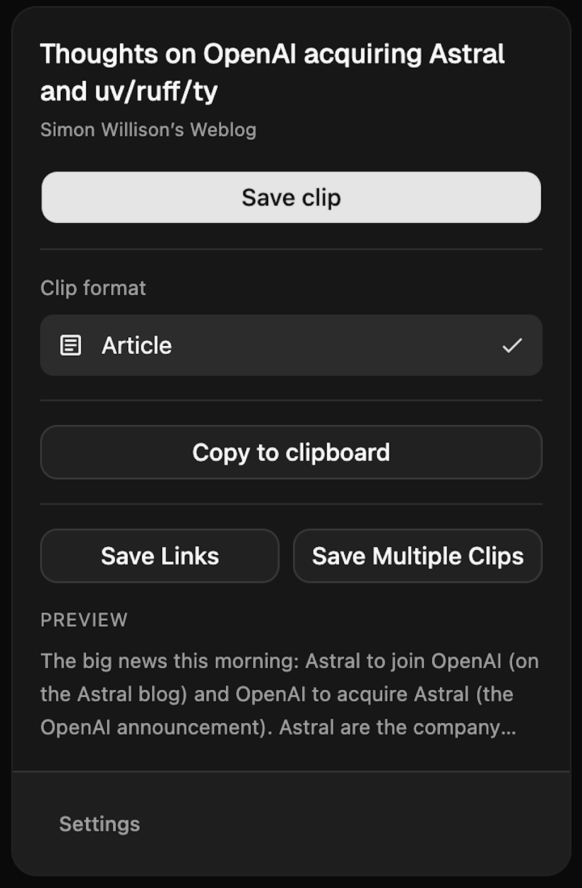

<p align="center">
  
</p>

<h1 align="center">Machdown</h1>

<p align="center">Clip web pages as clean Markdown into a git-backed knowledge base</p>

Machdown is a Chrome extension that extracts articles or highlighted selections
and converts them to Markdown. Use it on its own to copy or download clips, or
run the optional local daemon to organize, commit, and search a knowledge base.

> Code was 100% generated by AI.

- [Get started as a user](#get-started-as-a-user)
- [Get started with development](#get-started-with-development)
- [Major features](#major-features)
- [Use the extension](#use-the-extension)
- [Troubleshooting](#troubleshooting)
- [Project reference](#project-reference)

## Screenshots

<p align="center">
  
  
</p>

## Get started as a user

Machdown is not published to the Chrome Web Store. Build it from source and load
it as an unpacked extension. The daemon is optional: copying Markdown, downloading
clips, exporting a ZIP, and saving tab links work without it.

### 1. Prepare the source and tools

You need Chrome, Git, Node.js **22.18 or newer**, and **pnpm 12.3.2**, the version
pinned in `package.json`.

**The repository currently depends on a sibling `rm3-shared` checkout.** Its
`link:` dependencies are local paths, so cloning Machdown alone is not enough.
Obtain `rm3-shared` from the maintainer and arrange the folders like this:

```text
<workspace>/
  machdown/
  rm3-shared/
    packages/
      env/
      lefthook-config/
      oxfmt-config/
      oxlint-config/
      typescript-config/
```

From your workspace directory, clone Machdown:

```bash
git clone https://github.com/robmcguinness/machdown.git
```

Install the shared workspace's dependencies first, then Machdown's dependencies:

```bash
cd rm3-shared
pnpm install
cd ../machdown
pnpm install
```

The workspace also installs the optional daemon's dependencies, including native
modules for local search. Allow the install to finish before building.

### 2. Build the extension

From the `machdown` directory:

```bash
pnpm build
```

This builds the shared contract, type-checks the daemon, and bundles the extension.
The folder Chrome needs is **`apps/extension/build`**. It should contain
`manifest.json`, `service_worker.js`, `clipper.js`, and the extension pages.

### 3. Load it into Chrome

1. Enter `chrome://extensions` in Chrome's address bar.
2. Turn on **Developer mode**.
3. Click **Load unpacked** and select **`apps/extension/build`**. Select the
   folder containing `manifest.json`.
4. Confirm that a **Machdown** card appears.
5. Open Chrome's extensions menu (the puzzle-piece icon) and pin Machdown.

Keep the build folder in place; Chrome loads the extension from that location.

### 4. Save your first clip

1. Open a regular web article and wait for its content to load.
2. Click the Machdown toolbar icon. The popup shows the extracted title and
   **Article** under **Clip format**.
3. Click **Save clip**, choose a location in the save dialog, and open the `.md`
   file. It contains page metadata followed by the article as Markdown.

To paste the clip into another application, use **Copy to clipboard** instead.
The popup closes after a successful copy.

### Update your local installation

From your Machdown checkout:

```bash
git pull
pnpm install
pnpm build
```

Then open `chrome://extensions` and click the reload arrow on the Machdown card.
Close and reopen any Machdown options, batch, or search pages you already had
open. If the update changes shared dependencies, update your `rm3-shared`
checkout and install its dependencies too.

## Get started with development

### 1. Build and load a working baseline

Complete the [source setup and build](#get-started-as-a-user), then load
`apps/extension/build` into Chrome. From the repository root, install the Git
hooks and run the quality checks:

```bash
pnpm exec lefthook install
pnpm check
```

`pnpm check` runs formatting validation, linting, TypeScript checks, and tests.
Run it after adding or refactoring code and before submitting changes.

### 2. Choose a development loop

For browser-based UI development:

```bash
pnpm dev
```

Open the Vite URL printed in the terminal with one of these paths:

```text
/src/popup/index.html
/src/options/index.html
/src/tabs/index.html
/src/search/index.html
```

Vite serves the React pages, but a regular browser tab does not provide the
extension APIs needed for clipping, tab access, and extension storage. Verify
those workflows in the unpacked extension.

For UI changes in the unpacked extension:

```bash
pnpm --filter @machdown/extension build:watch
```

This runs an initial full extension build, then watches the **UI bundle only**.
Reload Machdown in `chrome://extensions` after a rebuild. Changes to the content
script or service worker require a fresh full build:

```bash
pnpm --filter @machdown/extension build
```

If you change `packages/contract`, run `pnpm build` from the root to rebuild its
outputs and dependents. You can also run `pnpm --filter @machdown/contract dev`
in another terminal to watch the contract during development.

### 3. Develop repository and search features

Run the daemon with file watching in a separate terminal:

```bash
pnpm --filter @machdown/daemon dev
```

Follow [Connect a local knowledge base](#connect-a-local-knowledge-base) to pair
the extension and initialize a folder. Use a disposable clip repository when
testing saves, adoption, or synchronization: these actions write files and Git
commits.

The daemon runs TypeScript directly with Node's type stripping. Its scripts use
`--conditions=source` to resolve the shared contract from source. For environment
configuration and API details, see the [daemon documentation](apps/daemon/README.md).

### 4. Verify a change

Run `pnpm check`, rebuild the extension, and reload it in Chrome. Exercise the
workflow you changed, such as saving an article, copying a selection, or exporting
a batch. Focused test commands are listed in [Development commands](#development-commands).

## Major features

| Feature                        | What you can do                                                                          | Needs the daemon? |
| ------------------------------ | ---------------------------------------------------------------------------------------- | ----------------- |
| Article and selection clipping | Extract the main article or only highlighted content as Markdown.                        | No                |
| Copy and download              | Copy a clip to the clipboard or save it as an `.md` file.                                | No                |
| Batch clipping                 | Select open tabs and export their content as a ZIP.                                      | No                |
| Tab-link export                | Save titles and URLs from open tabs in one Markdown file.                                | No                |
| Formatting and appearance      | Customize Markdown syntax, images, filenames, theme, and UI scale.                       | No                |
| Knowledge base                 | Save clips and link-only bookmarks into a Git repository with a generated contents page. | Yes               |
| Categories and suggestions     | Assign multiple categories and get suggestions based on existing saves.                  | Yes               |
| Search                         | Find clips and bookmarks with keyword, semantic, or hybrid search.                       | Yes               |
| Git synchronization            | Commit saves automatically and pull/push when you choose **Sync now**.                   | Yes               |

## Use the extension

### Clip an article or a selection

Open a web page and click Machdown. With no text selected, it extracts the main
article using Readability, falling back to an article/main element or a large
text block if needed.

To clip only part of a page, highlight that content **before opening the popup**.
The **Clip format** label changes to **Selection** automatically; there is no
mode selector. Clear the selection and reopen the popup to capture the article
again.

Click **Save clip** to save, or **Copy to clipboard** to copy. The popup's preview
is an excerpt when available; inspect the saved Markdown for the full result.

### Choose where clips are saved

Open **Settings → Repository** and choose the save destination:

| Setting                                           | Behavior of the popup's **Save clip** action                                                                               |
| ------------------------------------------------- | -------------------------------------------------------------------------------------------------------------------------- |
| **Repository when available, otherwise download** | Default. Saves to a ready repository; otherwise downloads. Also falls back to downloading if the repository request fails. |
| **Always the repository**                         | Saves through the daemon and reports an error if it cannot save.                                                           |
| **Always a browser download**                     | Opens a save dialog for the Markdown file.                                                                                 |

**Copy to clipboard** works independently of the save destination. The batch
page has its own repository/ZIP destination controls.

### Save several tabs at once

1. Open the popup on a web page and click **Save Multiple Clips**.
2. Select the tabs to capture, or use **Select all**. Restricted pages cannot be
   selected.
3. Choose **Export ZIP**, or **Save to repository** if your daemon and repository
   are ready.
4. For repository saves, review each tab's categories. Use **Default categories**
   and **Apply to all selected** when the same categories fit the whole batch.
5. Click the bottom **Export ZIP** or **Save to repository** button. Allow access
   to the selected sites if Chrome requests permission.
6. Wait for completion and review any per-tab errors. A ZIP downloads as
   `tabs-YYYY-MM-DD.zip`; successful repository clips are saved in one commit.

Keep the batch page open until the operation finishes. If the repository is
unavailable when choosing a destination, the page uses ZIP export.

### Save just the open-tab links

Click **Save Links** in the popup. Machdown downloads `tabs-YYYY-MM-DD.md` with a
list of tab titles and URLs across browser windows. This exports links without
reading each page's article content.

### Connect a local knowledge base

Use this optional setup for repository saves, bookmarks, categories, and search.
You need the source dependencies installed and Git available on your machine.

1. From the Machdown checkout, start the daemon and leave the terminal running:

    ```bash
    pnpm daemon
    ```

2. Copy the pairing code printed in the terminal.
3. Open the extension's **Settings → Repository**. Check that **Daemon address**
   matches the printed address (default: `http://127.0.0.1:41998`).
4. Enter the **Pairing code** and click **Pair**. Codes expire after ten minutes
   and can be used once. On macOS/Linux, `pnpm daemon:pair` issues a fresh code
   from the running daemon; on Windows, restart the daemon to get another code.
5. Enter a **Clip repository** path, such as `~/Workspaces/kb`, or select a folder
   with **Browse…**, then click **Initialize**. Use a dedicated folder for your
   knowledge base, separate from the Machdown source checkout.
6. Open an article, click Machdown, choose categories, and click **Save clip**.
   The popup reports the saved path. Your knowledge base now has a file under
   `clips/`, a generated `README.md`, and a Git commit.

For an existing flat Markdown archive, enable **Adopt existing markdown files**
before initializing to move its loose Markdown files into `clips/` and add the
required metadata. See the [daemon guide](apps/daemon/README.md) for adoption and
configuration details.

The daemon listens on loopback and stores its pairing state outside the clip
repository. Keep it running while using repository features.

### Organize clips and save bookmarks

In **Settings → Repository**, add, rename, or remove categories and choose the
**Default category**. Each clip needs at least one category and can have several.
Categories are stored in frontmatter; all documents live in the same `clips/`
folder and appear under their categories in the generated README.

With **Suggest categories** enabled, Machdown uses existing URL matches,
same-site saves, and similar documents to propose categories. Review the
preselected categories and suggestion chips before saving. Batch suggestions
are specific to each tab and can be overridden individually.

In the popup, click **Bookmark only** to save the title and URL without the page
body. Bookmarks are searchable Markdown stubs. Capturing that URL later upgrades
the existing bookmark to a full clip.

For an existing clip, the popup shows **Update clip**. Re-save it with new
categories to change its filing. URL normalization avoids duplicate files from
common tracking parameters; updates preserve the filename and original clipped
timestamp. Renaming or removing a category in settings only changes the picker:
previously saved files retain their old categories until you update them.

### Search your knowledge base

1. With the daemon running and a repository connected, click **Search clips** in
   the popup.
2. Enter a query and choose **Keyword**, **Semantic**, or **Hybrid**.
3. Optionally filter by categories and **Everything**, **Clips**, or **Bookmarks**.
4. Use a result's **Open source**, **Preview**, or **Open file** action.

Keyword search uses the local text index. For semantic search, first open
**Settings → Repository → Build embeddings**. Semantic search finds similar
meaning; hybrid search uses local model reranking. Model preparation can download
files and take time on first use. Search runs locally through embedded qmd; no
separate qmd installation is needed.

Saves refresh the text index in the background. Embeddings are built explicitly,
so run **Build embeddings** again after adding content you want to search
semantically. Selecting multiple categories matches any selected category.
Category filtering happens after search retrieves candidates, so a narrow filter
can return fewer results.

### Synchronize with a Git remote

Saves create local commits automatically. To synchronize, configure a remote,
branch tracking, and Git authentication in your clip repository using your usual
Git workflow. Then click **Settings → Repository → Sync now** to pull with rebase
and push. Machdown does not push in the background.

The knowledge base's `README.md` is generated. Put your own introductory text in
`.machdown/readme-intro.md` so it survives regeneration.

### Customize Markdown and behavior

Open **Settings** from the popup, or open Machdown's options from its Chrome
extension card. Changes save automatically.

| Settings tab   | Controls                                                                                                     |
| -------------- | ------------------------------------------------------------------------------------------------------------ |
| **Repository** | Daemon pairing, clip repository, categories, suggestions, embeddings, synchronization, and save destination. |
| **Appearance** | System/light/dark theme and UI scale from 85% to 120%.                                                       |
| **Formatting** | Heading style, list marker, link style, code block style and fence, and horizontal rule style.               |
| **Behavior**   | Include images, auto-copy, auto-close after saving, and filename pattern.                                    |

Filenames can use the title slug alone or add the date, site, or both. Clips
include YAML frontmatter with `title`, `url`, `site`, and `clipped`. Repository
saves also carry category and URL-normalization metadata. Images remain Markdown
references; Machdown does not bundle image files into the archive.

**Reset to defaults** resets extension settings while retaining the stored
pairing token. Repository-owned categories are synchronized from the daemon.

## Troubleshooting

| Problem                                                        | What to check                                                                                                                                                                                                 |
| -------------------------------------------------------------- | ------------------------------------------------------------------------------------------------------------------------------------------------------------------------------------------------------------- |
| Install/build cannot find an `@rm3/*` package or shared config | Verify the sibling `rm3-shared/packages/` layout and install dependencies in both checkouts.                                                                                                                  |
| Chrome reports a missing or unreadable manifest                | Build first, then select `apps/extension/build`, which directly contains `manifest.json`.                                                                                                                     |
| Changes do not appear                                          | Rebuild and reload the extension card. Content-script and service-worker changes need a full build, not only the UI watcher. Reopen extension pages.                                                          |
| The Vite popup says extension APIs are unavailable             | Test clipping through the loaded unpacked extension. Vite pages are for UI development.                                                                                                                       |
| A page cannot be clipped                                       | Use an ordinary HTTP/HTTPS page. Browser pages, extension pages, local files, and the Chrome Web Store cannot be clipped. For extraction problems, try highlighting the desired text and reopening the popup. |
| Batch clipping reports permission denied                       | Retry the export and allow access to the selected sites when Chrome prompts.                                                                                                                                  |
| The daemon is offline or pairing fails                         | Keep `pnpm daemon` running, check the address, and use a fresh pairing code.                                                                                                                                  |
| A save downloads instead of reaching the repository            | The default destination falls back to downloading. Check daemon pairing and repository initialization, or choose **Always the repository** to surface save errors.                                            |
| Semantic search has no useful results                          | Build embeddings in **Settings → Repository** and allow model preparation to finish. Try **Keyword** to check the text index.                                                                                 |
| Chrome shows “Service worker (inactive)”                       | The worker can idle between events; this alone does not indicate an error.                                                                                                                                    |

## Project reference

### Repository layout

```text
apps/
  extension/    Chrome extension: React, Vite, Tailwind
  daemon/       Local companion: Fastify, oRPC, Git, embedded qmd
packages/
  contract/     Shared oRPC and Zod protocol
```

The contract defines the protocol used by the daemon and extension, including
the generated OpenAPI document. See the [extension development notes](apps/extension/README.md)
and [daemon reference](apps/daemon/README.md) for implementation details.

### Development commands

Run these from the repository root:

| Command                                         | Purpose                                                  |
| ----------------------------------------------- | -------------------------------------------------------- |
| `pnpm build`                                    | Build the contract and extension; type-check the daemon. |
| `pnpm dev`                                      | Serve extension UI pages through Vite.                   |
| `pnpm --filter @machdown/extension build:watch` | Full initial extension build, followed by UI-only watch. |
| `pnpm daemon`                                   | Start the local daemon.                                  |
| `pnpm daemon:pair`                              | Issue a fresh pairing code on macOS/Linux.               |
| `pnpm --filter @machdown/daemon dev`            | Start the daemon with file watching.                     |
| `pnpm check`                                    | Run formatting, lint, type, and test checks.             |
| `pnpm test`                                     | Run workspace tests.                                     |
| `pnpm --filter @machdown/extension test`        | Run extension regression tests.                          |
| `pnpm --filter @machdown/daemon test`           | Run daemon tests with qmd disabled.                      |
| `pnpm typecheck`                                | Check TypeScript project references.                     |
| `pnpm lint`                                     | Run oxlint.                                              |
| `pnpm format` / `pnpm format:check`             | Apply formatting / check formatting.                     |

## Credits

Machdown uses Mozilla Readability for article extraction, DOMPurify for
sanitization, and Turndown for Markdown conversion. It builds on ideas and code
from these projects:

- [MarkDownload](https://github.com/deathau/markdownload) by deathau
- [chrome-extension-vite-react](https://github.com/lunalucid/chrome-extension-vite-react) by lunalucid
- [qmd](https://github.com/tobi/qmd) by tobi
