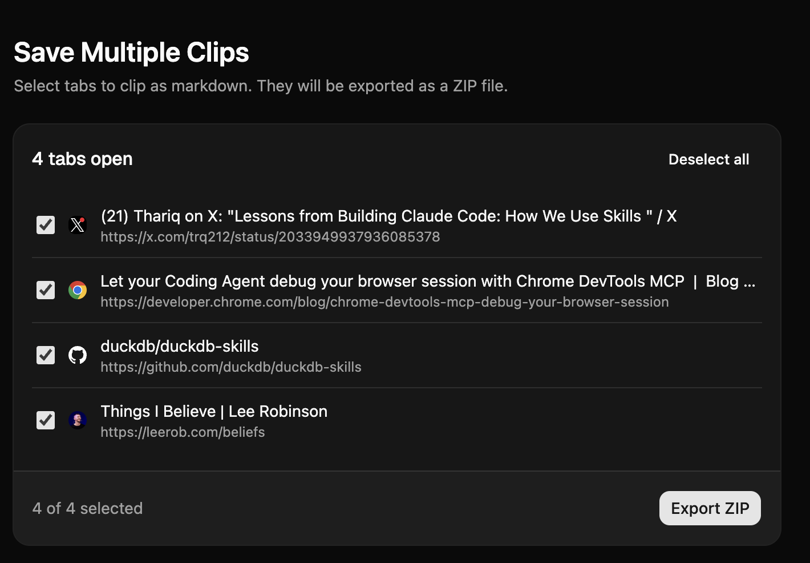

<p align="center">
  
</p>

<h1 align="center">Machdown</h1>

<p align="center">Clip web pages as clean Markdown</p>

## About

> Code was 100% generated by AI.

Machdown is a Chrome extension that extracts article content from web pages and converts it to Markdown. It uses [@mozilla/readability](https://github.com/mozilla/readability) for content extraction and [Turndown](https://github.com/mixmark-io/turndown) for HTML-to-Markdown conversion.

## Screenshots

<p align="center">
  
  
</p>

## Features

### Clipping

- **Article mode** extracts the main content using Readability, with a fallback that looks for `<article>`, `<main>`, or the largest text block when Readability can't find an article
- **Selection mode** clips only the text you've highlighted on the page
- **Batch clipping** opens a tab picker where you can select multiple tabs, clip them all at once, and download the results as a ZIP file
- **Tab links** saves the URLs and titles of all open tabs as a single Markdown file

### Markdown output

Each clip includes YAML frontmatter with the article title, source URL, site name, and an ISO 8601 timestamp. Headings use ATX style (`#`), code blocks are fenced with triple backticks, and list items use hyphens. Links, images, tables, and semantic HTML elements are preserved during conversion. Content is sanitized with DOMPurify before processing.

### Export

- Download as an `.md` file (filename is auto-slugified from the title)
- Copy to clipboard
- Batch download as a dated ZIP (`tabs-YYYY-MM-DD.zip`)
- Download tab links as a dated Markdown file (`tabs-YYYY-MM-DD.md`)

### Settings

- **Theme:** system, light, or dark
- **UI scale:** 85% to 120% in 5% increments
- **Reset to defaults** with one click

Settings are stored in `chrome.storage.local` and stay in sync across the popup, options page, and tabs page through a service worker.

### Tab filtering

Chrome internal pages (`chrome://`, `chrome-extension://`), other browser pages (`edge://`, `brave://`, etc.), `about:` pages, devtools, and the Chrome Web Store are automatically excluded from clipping.

## Getting started

### Install

```bash
pnpm install
```

### Dev

```bash
pnpm dev
```

### Build

```bash
pnpm build
```

## Load in Chrome

1. Build the extension: `pnpm build`
2. Open `chrome://extensions`
3. Enable Developer Mode
4. Click "Load unpacked" and select the `build/` directory

## Scripts

- `pnpm dev` -- start Vite dev server
- `pnpm build` -- build UI pages, service worker, and content script
- `pnpm build:watch` -- watch build for UI pages
- `pnpm lint` -- run oxlint (zero warnings policy)
- `pnpm format` -- format files with oxfmt
- `pnpm format:check` -- check formatting with oxfmt
- `pnpm preview` -- preview the built extension via Vite

## Credits

Machdown builds on ideas and code from these projects:

- [MarkDownload](https://github.com/deathau/markdownload) by deathau
- [chrome-extension-vite-react](https://github.com/lunalucid/chrome-extension-vite-react) by lunalucid
